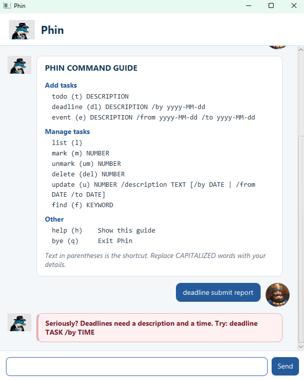

# Phin User Guide

Phin is a task manager for todos, deadlines, and events.



## Quick start

Type a command in the box at the bottom of the window and press **Enter** or
click **Send**. Commands are lowercase. Dates use the `yyyy-MM-dd` format, such
as `2026-09-17`.

## Getting help

Enter `help` (or its shortcut `h`) to see every command, its format, and its shortcut inside Phin.
Commands accept the following shortcuts: `l` for `list`, `t` for `todo`, `dl` for `deadline`, `e` for
`event`, `m` for `mark`, `um` for `unmark`, `del` for `delete`, `u` for `update`, `f` for `find`, and
`q` for `bye`.

## Adding tasks

### Todo

Adds a task without a date:

`todo DESCRIPTION`

Example: `todo read chapter 1`

Shortcut: `t`

### Deadline

Adds a task that must be completed by a date:

`deadline DESCRIPTION /by yyyy-MM-dd`

Example: `deadline submit report /by 2026-09-20`

Shortcut: `dl`

### Event

Adds an activity with a start and end date. The end date cannot be earlier than
the start date.

`event DESCRIPTION /from yyyy-MM-dd /to yyyy-MM-dd`

Example: `event orientation /from 2026-09-20 /to 2026-09-21`

Shortcut: `e`

Phin rejects blank descriptions, impossible dates, invalid date ranges, and
duplicate tasks without changing the task list.

## Viewing tasks

Enter `list` to display every task and its number. Completed tasks use `[X]` and
incomplete tasks use `[ ]`.

Shortcut: `l`

## Marking tasks

Use the number shown by `list`:

- `mark NUMBER` marks a task as completed. Shortcut: `m`.
- `unmark NUMBER` marks a task as incomplete. Shortcut: `um`.

Example: `mark 2`

## Deleting tasks

`delete NUMBER`

Example: `delete 3`

Shortcut: `del`

After deletion, the remaining tasks are renumbered.

## Finding tasks

`find KEYWORD`

Example: `find report`

Shortcut: `f`

Phin searches task descriptions using an exact, case-sensitive substring.

## Updating a task

Use `update NUMBER` followed by one or more fields. Fields not included in the
command stay unchanged, as do the task type and completion status.

- Every task supports `/description TEXT`.
- Deadlines also support `/by yyyy-MM-dd`.
- Events also support `/from yyyy-MM-dd` and `/to yyyy-MM-dd`.

For example, this command changes only the end date of task 3:

`update 3 /to 2024-03-05`

Phin responds with the complete updated task:

```text
    Fine. I've updated this task:
      [E][ ] project meeting (from: Mar 01 2024 to: Mar 05 2024)
```

You may update multiple fields together:

`update 2 /description submit final report /by 2024-03-08`

Use each field at most once. Phin rejects blank, unknown, or type-incompatible
fields. It also rejects invalid dates and event ranges without changing the task.

## Saving and loading

Phin automatically saves task changes to `data/phin.txt` and loads them the
next time it starts. If the file is missing, Phin starts with an empty list and
creates the file when a task change is saved.

If saved data is corrupt or cannot be read, Phin reports the problem and does
not overwrite the file. If a save fails, Phin warns that the latest changes are
available only in memory.

## Exiting

Enter `bye` to close Phin. Shortcut: `q`.
